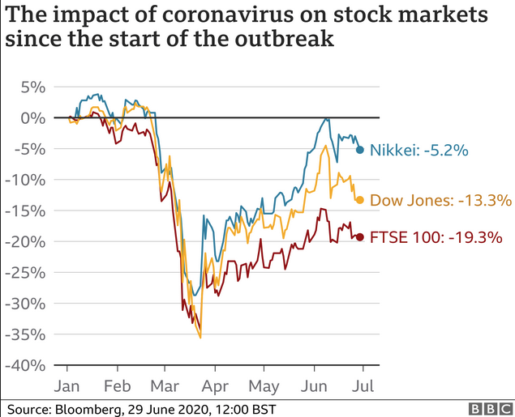
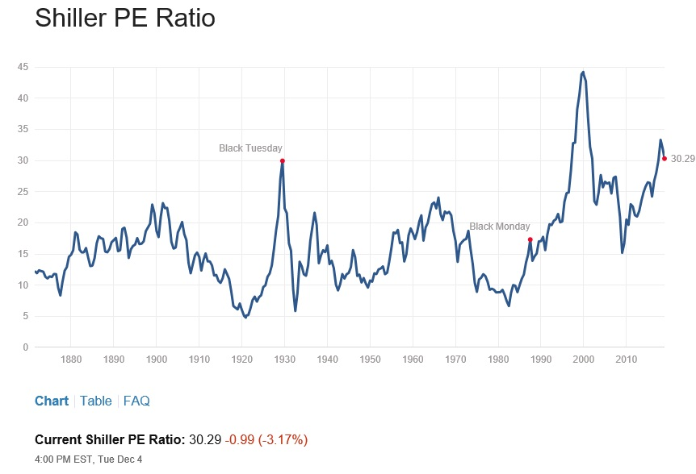
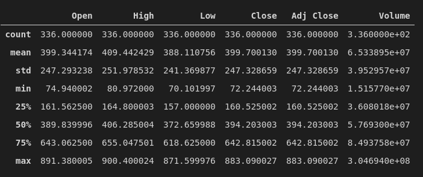
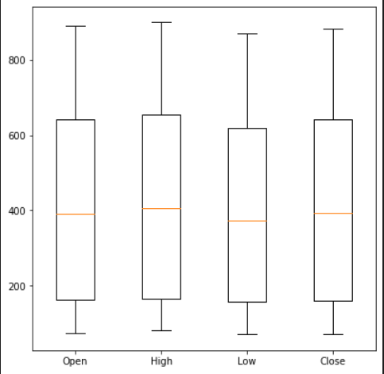
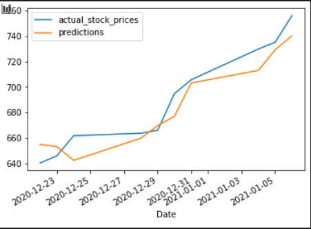
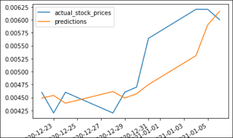
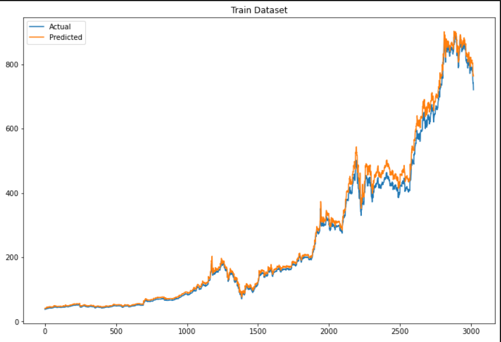
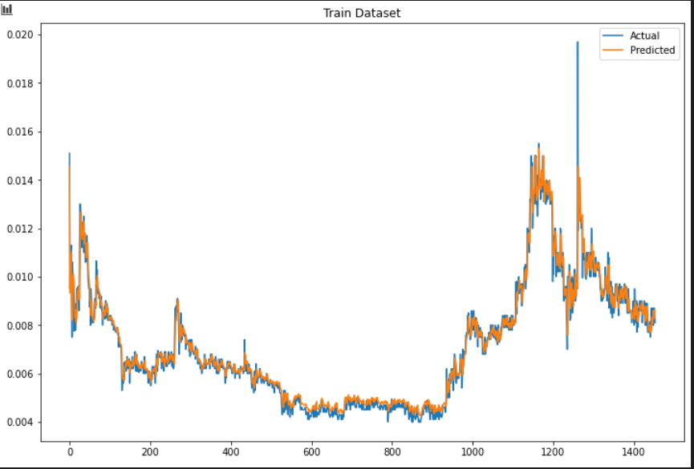
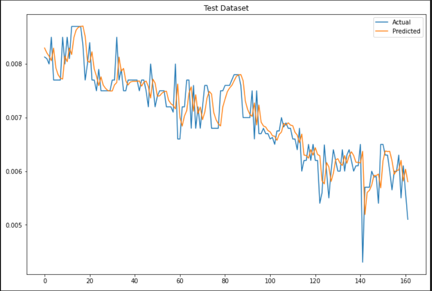
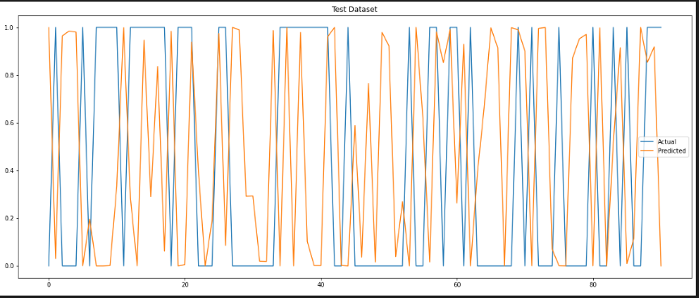

# Data story 

In the first section of the data story we would like to show some of the possible impacts that certain developments, events or for instance the climate change can bring to the stock market.
After studying the stock market for the last couple of weeks, it looks like it is nearly impossible to predict any certain outcome of any stocks. Evertying is just so unpredictable. One litte tweet from a american president or like in the recent weeks a message from Elon Musk, can bring some of the stocks down or up. A region or a counrty that had a crisis, like a enviroment disaster, extrem weather condition or any other extraordinarily phenomenon, can have no, litte or extrem impact to the stock market. A recent example that had a large impact, is and has been the Coronavirus. 

</br>



</br>

In our study, we try to predict the stock with help of articles we find on for example yahoo finance. The idea is to create a model on historik data, feed the machine learning algorithm with the article data and get some sort of prediction whether a certain stock will drop or raise. After mentioning all the impact certain things has on the stock market, it's gonna be tuff or even impossible to predict a drop or a raise. 
</br>
To predict in the best possible way, we first have to ask ourselfs some questions.. 
- Is the article from a reliable source?
- What is mentioned in the articel - names, brands, weather conditions, disasters, famine .... 
- When is the article from?
- Who wrote the article?
- ....

</br>

We are far from implementing all those facts in our algorithm, so even if we think our forecast is close to perfection, it still just will be a **good guess** and nothing more.

***

## Stock development. 

The general trend in share price development is increasing. Sometimes, however, events occur that affect stock prices extraordinarily. For example, Black Tuesday in 1929 and Black Monday in 1987.

</br>



</br>

* [Black Tuesday, Its Causes and How It Kicked Off the Depression](https://www.thebalance.com/black-tuesday-definition-cause-kickoff-to-depression-3305819)
* [The Stock Market Crash of 1987?](https://www.investopedia.com/ask/answers/042115/what-caused-black-monday-stock-market-crash-1987.asp)

***

## Shares in green economy.

Global circumstances may affect the price development of equities in affected sectors. Today's climate challenges include helps to determine the price development of shares in the 'green' economy. 
Like everything else, the climate change and the technology that follows with it, is also influence the stock market.

Here are just some examples what that means:

* [Why does climate change get described as a 'stock-flow' problem?](https://www.theguardian.com/environment/2012/feb/20/climate-change-stock-flow)
* [5 Best Climate Change Stocks To Buy Now](https://www.insidermonkey.com/blog/5-best-climate-change-stocks-to-buy-now-910461/)
* [Is Climate Change Affecting the Stock Market?](https://www.edhec.edu/en/phd-finance/theses/climate-change-affecting-stock-market-study-impact-extreme-weather-events-stock)

</br>

***

## Online trends can also affect the market. 

An ever-increasing number of media form the basis for decision-making for stock traders. Trends in these media are also reflected in stock prices.   

* [Does the Financial Media Affect the Stock Market?](https://theirrelevantinvestor.com/2020/07/28/does-the-media-affect-the-stock-market/)

***
***

# Stock prediction story


**1. Predicting The Stock Price with help of linear regression**

The first part in our prediction story starts with a "simple" linaer regression model. (A linear approximation of a causal relationship between two or more variables.)
</br>
</br>
Notebook: ```tesla_linear_regression.ipynb```
</br>
</br>
Our **sample** subset data consist of 314 rows of **quantitative** stock market data from TESLA between 2021-March-30 and 2020-Januar-02.

Below we can see a description of our dataset that includes the mean (the average of the set), std (standard deviation) that measures the dispersion of the data-set around its mean and the min and max of each set. 
</br>



</br>

The min, max and the first, second and third quartil at the above description is used down below in our boxplot diagram. 

</br>



</br>

The below diagram shows with help of our linaer regression model, the actual and the prediction of Tesla stock. In this particular case the prediction is not that far away from the actual stock line. With some exceptions of course. 
</br>



</br>

Down here we tried a different stock, Amazon. And as we clearly can observe, our predicten in that case is far of from the actual stock price.

The question now would be to find out and to analyse why the same model spits out predictions that are so far from the actuall trues. Is it because we get the data direct from yahoo finance, and we haven't done any datacheck, like null values, data inconsistency and so on, that we can't be sure of, that we have the same starting point each time we predict?

</br>



</br>

***
***

**2. Predicting The Stock Price with help of a LTSM model (Long Short Term Memory networks)**

The same or simular procedure with the linear model are used but with a different model - LTSM. We hope that this model will give us a better result than the one above. In the case of Tesla stocks, the model actually shows an remarkable progress.
</br>
The diagram below shows the training set output of the model with improving results regarding the prediction on the Tesla stock price.

</br>



</br>

As before in the linear model, we also used Amazon's stock data to see if the new model would improve the prediction. With the help of the second model, we remember that the prediction of the first model was quite far of in the case of amazon stock, we can see now a remarkable improvment.
</br>
Below you can see the prediction of Amazon stock prices, with help of the test and train data. Both diagrams shows, with some variations, that the second model is a better choice when predicting outcomes on the stock market. 
</br>



</br>
</br>



</br>

***
***

**3. Predicting if the Stock Price will go up or down with help of an sentence analyser**


Some more than 5000 rows of stock market related text data from tweets are used for the sentence analyser.

In the first attempt we used the raw data from our source to make some predictions and thereafter used a cleaning data proccess to get rid of unwanted http links, stopwords and upper case letters. 

</br>

Notebook: ```datacleansing_sentiment.ipynb```

</br>

**Cleaned dataset**
</br>


</br>

**Raw dataset**

</br>



</br>

In the shown figures above, both diagrams, either with the clean dataset or the raw set, doesn't show a large enough differences to say which one to use would be best. But that in mind, it would suggest that we maybe are far off from the right solution. It would normaly suggest that a cleaned dataset would show a much larger differences compare the to the raw data-set. In this case we need to go back on the drawing board, to find a diffrent solution to our problem.

***
***

## Conclusion

We are far from finalizing a product, that could predict, with some certainy of success, the outcome of stock. And to be honest, if we could do that, we would be rich by now.
The next step would be to bring together the LDSM model with the sentence analyser. In that way we could see if articles or tweets had impact on the stock market. Comparing those two models in the same time-span data set, we could see how and if our hypothesis can be proven or discard.

We could consider different models, different algorithm, diffrent datasource, changing the train and test set on the models and so on. The possibilities are quite big.

There is no doubt that articles, tweets have some kind of influence on the stock market. The difficulty is to know when and why. Stock market has a one factor that in any case is unpredictable....**the human factor**.


