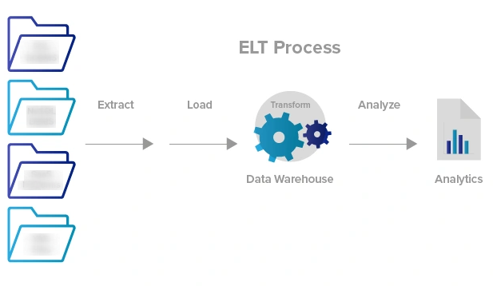
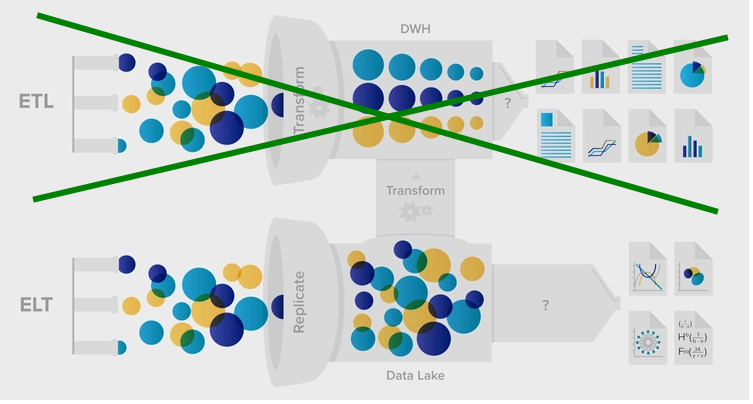

# Business Data Storytelling

### Relevant data sources from the Internet and other media used in the experiment.  

**Links to download relevant articles, tweets or messages:**

* [Yahoo finance](https://finance.yahoo.com/)
* [News API](https://newsapi.org/pricing)
* [Twitter: @Investors Tesla](https://twitter.com/search?q=%40investors.com%20tesla&src=typed_query)

**Links to retrieve stock data :**
* [Alpha Vantage](https://www.alphavantage.co/)
    * [TESLA, 5min interval, JSON format](https://www.alphavantage.co/query?function=TIME_SERIES_INTRADAY&symbol=TELA&interval=5min&apikey=dcfec1f32fa846f98fd8f0849bbcd21d)

**Datalink for Sentiment Analysis:**

* [Kaggle](https://www.kaggle.com/)

***

### Integration of data using [ELT](https://www.xplenty.com/blog/etl-vs-elt/#overview)(Extract, Load, and Transform)

 

 
 

1. We **E**xtract data through an api and save data in a csv file. 
2. We **L**oad our extracted data using python. 
3. We **T**ransform our loaded data, using python. 

 

 
 

***

### Database

In this project, data will not be stored in any database nor is the data fetched continuosly from an api. The data in this project is collected once, cleaned through a cleaning proccess in python and then used for further analysis.

***

### Data story
